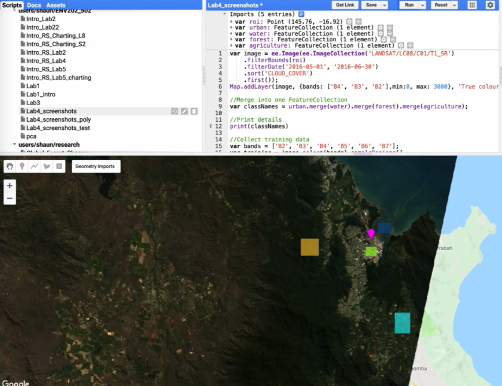
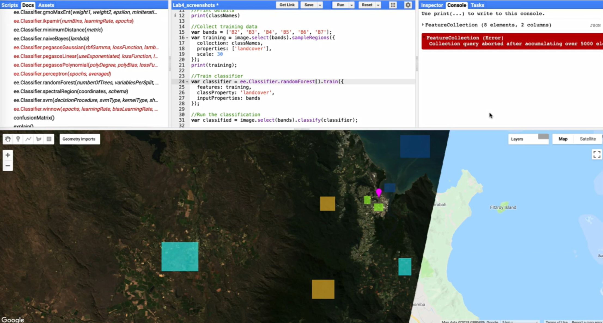

GEARS - Geospatial Ecology and Remote Sensing lab - https://www.gears-lab.com

# Introduction to Remote Sensing of the Environment
Lab 5 - Image Classification - part 2
--------------

### Acknowledgments
- Google Earth Engine Team
- Google Earth Engine Developers group

------

### Prerequisites
-------------

Completion of this lab exercise requires use of the Google Chrome browser and a Google Earth Engine account. If you have not yet signed up - please do so now in a new tab:

[Earth Engine account registration](https://signup.earthengine.google.com/)

Once registered you can access the Earth Engine environment here:
https://code.earthengine.google.com

This lab follows on from others in this series:

[Lab 1](https://github.com/naribi/GEARS/blob/master/Intro_RS_Lab1.md) -
[Lab 2](https://github.com/naribi/GEARS/blob/master/Intro_RS_Lab2.md) -
[Lab 3](https://github.com/naribi/GEARS/blob/master/Intro_RS_Lab3.md) -
[Lab 4](https://github.com/naribi/GEARS/blob/master/Intro_RS_Lab4.md)

------------------------------------------------------------------------

### Objective

The objective of this lab is to deepen your understanding of the image classification process and enhance last week's classification. 


----------

## Load up your previous classification from last week

To begin, we'll load your previous classification. Hopefully, you saved your project last week. 
If you did not save it, repeat the steps from [Lab 4](https://github.com/naribi/GEARS/blob/master/Intro_RS_Lab4.md) and be sure to save it this time. 
You might recall that we created various geometries, including a Region of Interest (ROI) used as a spatial filter to locate our image. 
Subsequently, we established four land cover classes, each containing 25 points. 
I have provided the full code below, but remember that you need to manually collect the training data and assign landcover properties.

```JavaScript
//Filter image collection for time window, spatial location, and cloud cover
var image = ee.Image(ee.ImageCollection('LANDSAT/LC08/C01/T1_SR')
    .filterBounds(roi)
    .filterDate('2016-05-01', '2016-06-30')
    .sort('CLOUD_COVER')
    .first());

//Add true-clour composite to map
Map.addLayer(image, {bands: ['B4', 'B3', 'B2'],min:0, max: 3000}, 'True colour image');

//Merge features into one FeatureCollection
var classNames = urban.merge(water).merge(forest).merge(agriculture);

//Select bands to use
var bands = ['B2', 'B3', 'B4', 'B5', 'B6', 'B7'];

//Sample the reflectance values for each training point
var training = image.select(bands).sampleRegions({
  collection: classNames,
  properties: ['landcover'],
  scale: 30
});

//Train the classifier - in this case using a CART regression tree
var classifier = ee.Classifier.cart().train({
  features: training,
  classProperty: 'landcover',
  inputProperties: bands
});

//Run the classification
var classified = image.select(bands).classify(classifier);

//Display the classification map
Map.centerObject(classNames, 11);
Map.addLayer(classified,
{min: 0, max: 3, palette: ['red', 'blue', 'green','yellow']},
'classification');
```


-----
## Improving the Classification

We ended last week with a discussion on whether or not we were happy with this classification. Even without any quantitative data, it was clearly lacking in some regions. How can we improve it? There are a few options we can explore:

1. Change the training sample size. We only sampled 25 pixels per class. This was a lot of clicking, but we could use polygons instead of points to sample more pixels for training.
2. Remember that in our previous session, our focus was primarily on learning how to sample training data and execute the classification. Now, we have various options to refine our methodology.
Let's consider a change in our sampling strategy. Although we collected the same number of points per class, some landcover classes represent a much larger area than others. 
An initial adjustment we could make involves reevaluating the training sample size. Initially, we selected 25 pixels per class, a process that demanded a significant amount of clicking. 
A more efficient alternative involves using polygons instead of points. 
Utilizing polygons allows for a more comprehensive representation by encompassing a larger area, thus significantly enhancing the diversity within our training dataset.
To proceed, we will revisit the import section where the four classes (agriculture, forests, water, and urban) were defined, and remove them in order to make these adjustments.
The next step involves redefining these classes using a new tool - the rectangle tool. This tool enables us to draw shapes (rectangles, in this case) directly in Earth Engine. 
By clicking four times, we'll create the four necessary geometries using the same naming convention as last week: urban, water, forests, and agriculture. 
While doing this, we'll also adjust these settings to refine our classification (i.e. the same FeatureCollection).


4. Change the classifier. We used a CART classifier, we could try a different approach such as a support vector machine (SVM) or randomForest (randomForest) approach.

   
6. Change the bands. We could add ancillary information, such as elevation data, or a derived index such as NDVI to provide for information for class discrimination.
7. Change the image. We used a winter scene from Landsat-8. We could try a summer scene, or switch to a Sentinel-2 image.


-------
### Thank you

I hope you found that useful. A recorded video of this tutorial can be found on my YouTube Channel's [Introduction to Remote Sensing of the Environment Playlist](https://www.youtube.com/playlist?list=PLf6lu3bePWHDi3-lrSqiyInMGQXM34TSV) and on my lab website [GEARS](https://www.gears-lab.com).

#### Kind regards, Shaun R Levick
------
